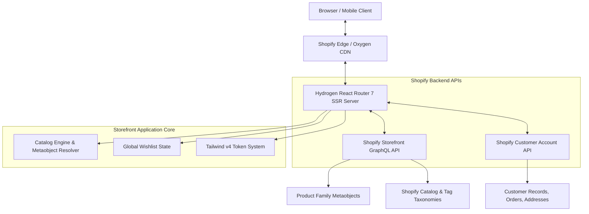
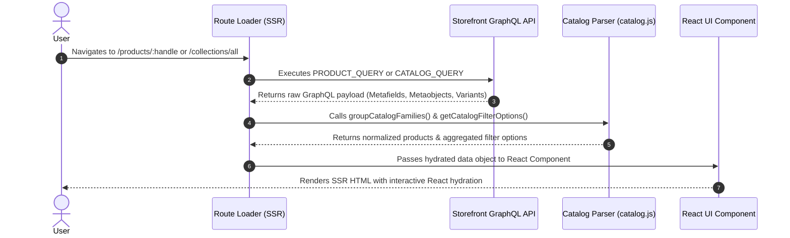

# UniinX Shopify Hydrogen Storefront — Developer & Architecture Wiki

Welcome to the official developer wiki and technical documentation for the **UniinX Shopify Hydrogen Storefront**.

This repository powers the high-performance, luxury e-commerce experience for **UniinX** — an Indian streetwear and lifestyle brand celebrating typography, native scripts, and modern design aesthetics. Built on **Shopify Hydrogen**, **React Router 7**, **Tailwind CSS v4**, and **Framer Motion**, this storefront delivers sub-second page loads, real-time variant customization, multi-lingual script switching, and a member dashboard.

---

## 📋 Table of Contents

1. [Architecture & Technology Stack](#1-architecture--technology-stack)
2. [Design System & Visual Tokens](#2-design-system--visual-tokens)
3. [GraphQL & Data Fetching Pipeline](#3-graphql--data-fetching-pipeline)
4. [Product Data Schema & Parsing Examples](#4-product-data-schema--parsing-examples)
5. [Catalog Filtering & Paginated Option Accumulation](#5-catalog-filtering--paginated-option-accumulation)
6. [Member Account Dashboard & Wishlist System](#6-member-account-dashboard--wishlist-system)
7. [State Management & Performance Optimization](#7-state-management--performance-optimization)
8. [Testing, Maintenance & Deployment Guide](#8-testing-maintenance--deployment-guide)

---

## 1. Architecture & Technology Stack

The UniinX storefront is designed as a decoupled, server-side rendered (SSR) web application deployed on **Shopify Oxygen**.

### Core Technologies

| Layer | Technology | Purpose |
| :--- | :--- | :--- |
| **Framework** | Shopify Hydrogen (v2026.4+) | Headless Shopify storefront engine with built-in sub-request caching |
| **Routing / SSR** | React Router 7 / Remix | Hybrid SSR, data loaders, actions, and client-side page transitions |
| **Styling** | Tailwind CSS v4 | CSS-first tokenized utility styling |
| **Animations** | Framer Motion (v12+) | Micro-interactions, page transitions, and smooth scroll reveals |
| **State** | React Context + `localStorage` | Global Wishlist, optimistic cart updates, and multi-lingual logo state |
| **Testing** | Vitest + React Testing Library | Fast unit testing for components, catalog helpers, and context providers |
| **Hosting** | Shopify Oxygen | Edge-rendered deployment platform with zero-cold-start performance |

### High-Level System Architecture Flow



---

## 2. Design System & Visual Tokens

The UniinX visual identity is defined by a clean, monochromatic luxury aesthetic. Off-white cream backgrounds (`#faf9f6`) have been removed in favor of pure white (`#ffffff`) surfaces, crisp borders (`border-black/10`), and deep black typography (`#121212`).

### Color System Tokens

| Token / Class | Hex / Value | Application |
| :--- | :--- | :--- |
| `bg-white` | `#FFFFFF` | Primary background for pages, cards, panels, and forms |
| `bg-black` | `#121212` | Primary buttons, active navigation tabs, badge pills, and dark panels |
| `bg-black/[0.02]` | `rgba(0,0,0,0.02)` | Subtle secondary panel fills and quick-access cards |
| `border-black/10` | `rgba(0,0,0,0.10)` | Card borders, dividers, and input field boundaries |
| `text-black` | `#121212` | Primary headings, product titles, prices, and emphasis text |
| `text-black/50` | `rgba(0,0,0,0.50)` | Muted body copy, timestamps, and section eyebrow labels |

### Motion & Micro-Animations

- **`Reveal` (`app/components/motion/Reveal.jsx`):** Smooth fade-up scroll animations using Framer Motion with intersection observer triggers.
- **`CrossFade` (`app/components/motion/CrossFade.jsx`):** Smooth cross-dissolve transitions for variant swatch image updates.
- **Touch Snap Scrolling:** Horizontal navigation tab bars (`account.jsx`) and theme swipe bars utilize `snap-x snap-mandatory` with hidden scrollbars for native mobile app feel.

---

## 3. GraphQL & Data Fetching Pipeline

All product catalog data is retrieved from the **Shopify Storefront API**, while member profiles, orders, and addresses are managed via the **Shopify Customer Account API**.

### Data Pipeline Architecture



---

## 4. Product Data Schema & Parsing Examples

UniinX utilizes **Shopify Metaobjects** (`custom.product_family`) to group distinct colorways into a unified product family experience. Each colorway exists as an independent product entry in Shopify, while sharing family swatches and metadata.

### Example Raw GraphQL Product Payload

```json
{
  "data": {
    "product": {
      "id": "gid://shopify/Product/9876543210",
      "title": "Antariksham Oversized Tee - Pitch Black",
      "handle": "antariksham-oversized-tee-black",
      "productType": "Oversized T-Shirt",
      "tags": ["men", "women", "unisex", "space", "tshirt", "oversized"],
      "collectionName": { "value": "Antariksham" },
      "language": { "value": "Telugu" },
      "familyValue": { "value": "Pitch Black" },
      "priceRange": {
        "minVariantPrice": { "amount": "1499.00", "currencyCode": "INR" }
      },
      "productFamily": {
        "reference": {
          "__typename": "Metaobject",
          "id": "gid://shopify/Metaobject/12345",
          "title": "Antariksham Oversized Tee Family",
          "products": {
            "references": {
              "nodes": [
                {
                  "id": "gid://shopify/Product/9876543210",
                  "title": "Antariksham Oversized Tee - Pitch Black",
                  "handle": "antariksham-oversized-tee-black",
                  "familyValue": { "value": "Pitch Black" }
                },
                {
                  "id": "gid://shopify/Product/9876543211",
                  "title": "Antariksham Oversized Tee - Stellar White",
                  "handle": "antariksham-oversized-tee-white",
                  "familyValue": { "value": "Stellar White" }
                }
              ]
            }
          }
        }
      }
    }
  }
}
```

### Parsing & Normalization Logic (`app/lib/catalog.js`)

Below is a snippet demonstrating how `catalog.js` normalizes product categories, extracts multi-variant family swatches, and resolves collection titles:

```javascript
// Normalizes category spellings to standard brand labels
export function categoryLabel(value) {
  const normalized = normalizeCatalogValue(value);
  const exact = CATEGORY_LABELS.get(normalized);
  if (exact) return exact;
  return collectionTitleMatches.find(([key]) => normalized.includes(key))?.[1] ?? null;
}

// Groups family member products to prevent duplicate listings on PLP grids
export function groupCatalogFamilies(connection) {
  const seenFamilies = new Set();
  const nodes = [];

  for (const product of connection?.nodes ?? []) {
    const family = product.productFamily?.reference;
    const familyId = family?.__typename === 'Metaobject' ? family.id : null;
    if (familyId && seenFamilies.has(familyId)) continue;
    if (familyId) seenFamilies.add(familyId);
    nodes.push(product);
  }

  return { ...connection, nodes };
}
```

---

## 5. Catalog Filtering & Paginated Option Accumulation

To prevent filter options (categories, themes, colors, sizes) from disappearing or resetting when paginating through product pages, the storefront uses a stateful option accumulator.

### Paginated Filter Accumulation Flow

```mermaid
flowchart LR
    Page1[Page 1 Request] --> Loader1[Loader returns Page 1 Filter Options]
    Loader1 --> Accumulator[mergeCatalogFilterOptions()]
    Accumulator --> State[CatalogFilters State: Page 1 + Page 2 Options]
    
    Page2[Page 2 Load More] --> Loader2[Loader returns Page 2 Filter Options]
    Loader2 --> Accumulator
    
    FilterChange[User Selects New Filter] --> Reset[Reset Accumulator Baseline]
    Reset --> Accumulator
```

### Filter Option Merger (`mergeCatalogFilterOptions`)

```javascript
export function mergeCatalogFilterOptions(accumulated = {}, incoming = {}) {
  const categoriesMap = new Map();

  const addCategory = (item) => {
    if (!item) return;
    const label = typeof item === 'object' && item !== null ? item.label : item;
    const value = typeof item === 'object' && item !== null ? item.value : item;
    if (label && !categoriesMap.has(String(label).toLowerCase())) {
      categoriesMap.set(String(label).toLowerCase(), { label, value: value || label });
    }
  };

  for (const item of accumulated.categories || []) addCategory(item);
  for (const item of incoming.categories || []) addCategory(item);

  return {
    categories: Array.from(categoriesMap.values()).sort((a, b) => a.label.localeCompare(b.label)),
    themes: mergeUniqueList(accumulated.themes, incoming.themes),
    languages: mergeUniqueList(accumulated.languages, incoming.languages),
    colors: mergeUniqueList(accumulated.colors, incoming.colors),
    sizes: sortedSizes,
  };
}
```

---

## 6. Member Account Dashboard & Wishlist System

The member dashboard at `/account` is structured with unified navigation tabs and clean profile management cards.

### Navigation Structure (`/account`)

1. **`01 Overview` (`/account._index.jsx`):** Quick access 2-column service grid & latest order status tracker.
2. **`02 Orders & Tracking` (`/account.orders.jsx`):** Full order history with line item thumbnails, fulfillment statuses, and tracking links.
3. **`03 Profile & Addresses` (`/account.profile.jsx`):** Merged profile editor for account name, verified email, phone number (SMS/courier updates), and default delivery shipping address.
4. **`04 Sign-in & Security` (`/account.security.jsx`):** Session protection, passkeys/OTP sign-in, and privacy export/deletion controls.
5. **`05 Store Policies` (`/account.policies.jsx`):** Shipping, returns, and customer rights policies.
6. **`06 Support & Returns` (`/account.support.jsx`):** Direct customer care contact form.
7. **`07 Wishlist` (`/account.wishlist.jsx`):** Saved favorites collection grid.

### Global Wishlist Context (`WishlistContext.jsx`)

Wishlist state is persisted across browser sessions using `localStorage` key `uniinx_wishlist_v1` and exposed globally via `useWishlist()`.

```jsx
// Example usage in ProductCard.jsx or Configurator.jsx
const { isSaved, toggleWishlist } = useWishlist();

<button
  type="button"
  onClick={() => toggleWishlist(product)}
  aria-label={isSaved(product.id) ? "Remove from wishlist" : "Add to wishlist"}
  className="grid size-10 place-items-center rounded-full bg-white/80 backdrop-blur-md"
>
  <HeartIcon className={isSaved(product.id) ? "fill-black stroke-black" : "stroke-black"} />
</button>
```

---

## 7. State Management & Performance Optimization

- **Optimistic Cart UI:** Uses Hydrogen's `useOptimisticCart` hook to render instant cart badge updates before server response.
- **Image Optimization:** Uses `@shopify/hydrogen` `<Image>` component for responsive `srcset`, automatic WebP/AVIF formatting, and lazy loading.
- **Sub-Request Caching:** API requests leverage `CacheShort()` and `CacheLong()` strategies to minimize Shopify API latency.

---

## 8. Testing, Maintenance & Deployment Guide

### Local Development Setup

```bash
# Navigate to UI storefront root
cd UI

# Install dependencies
npm install

# Start local Hydrogen dev server with Customer Account API push
npm run dev
```

### Running Unit Tests

The test suite contains **34 test files with 124 passing tests** built using Vitest and React Testing Library.

```bash
# Execute full test suite
npm run test

# Run tests in watch mode
npx vitest
```

### Production Build & Deployment

```bash
# Compile client assets and Hydrogen Oxygen SSR server bundle
npm run build

# Deploy to Shopify Oxygen platform (via Shopify CLI)
npx shopify hydrogen deploy
```

---

*Documentation maintained by the UniinX Engineering Team.*
